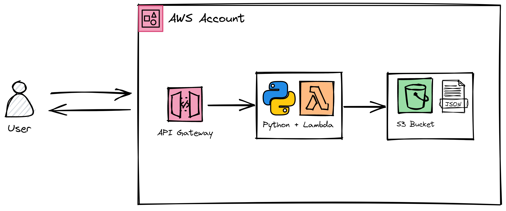

# AWS Serverless Resume API
Create a serverless API backed by a Python-based Lambda function and S3 bucket that responds to HTTP requests with your resume in JSON format—all in AWS. 
(Want to do this automatically? Use this SAM)
## Architecture



* API Gateway to deploy your API
* Lambda to create your serverless function, using Python (or your language of choice)
* S3 to store your document in JSON format 

## You'll need
* An AWS account
* Optional: A development environment of your choice (Lambda's built-in console is also sufficient)

### Step 1: Prepare your S3 bucket
Log into your AWS account:

`aws configure`

Enter your access key, secret access key, default region name, and output format. 

Next, create your bucket:

`aws s3api create-bucket --bucket your-bucket-name --region your-region`

Then, copy your resume to your bucket:

`aws s3 cp /path/to/resume.json s3://your-bucket-name/`

### Step 2: Create your Python script

```
# Boto3 is the AWS SDK for Python, json will allow us to easily parse JSON data
import boto3
import json

# Create your boto3 S3 client object, used to interact with S3, and create
# your variables to store your bucket name and resume key
s3 = boto3.client('s3')
bucket_name = 'your-bucket-name'
resume_key = 'resume.json'

# Create the function that Lambda will execute when the API Gateway event is triggered
def lambda_handler(event, context):
    # Read the resume file from S3
    response = s3.get_object(Bucket=bucket_name, Key=resume_key)
    resume_data = response['Body'].read().decode('utf-8')

    # Parse the JSON data
    resume_json = json.loads(resume_data)

    # Set HTTP response headers
    headers = {
        'Content-Type': 'application/json',
        'Access-Control-Allow-Origin': '*'
    }

    # Return the formatted resume data as an HTTP response
    return {
        'statusCode': 200,
        'headers': headers,
        'body': resume_json
    }
```

### Step 3: Setup your IAM role, policy, and Lambda function

Create your execution role:
` aws iam create-role --role-name s3-lambda-role --assume-role-policy-document "{\"Version\":\"2012-10-17\",\"Statement\":[{\"Effect\":\"Allow\",\"Principal\":{\"Service\":\"lambda.amazonaws.com\"},\"Action\":\"sts:AssumeRole\"}]}" `

Next, setup your Lambda function:
` aws lambda create-function --function-name resume-function --runtime python3.9 --handler lambda_function.lambda_handler --zip-file fileb://path/to/lambda_function.zip --role arn:aws:iam::your-account-id:role/s3-lambda-role `

Not working yet, because no policy is attached to the role

Replace 'your-account-id' with your AWS account ID. 
Note: To get your account id, you can use the following command: 

` aws sts get-caller-identity --query Account --output text `

This policy will allow the Lambda function to invoke itself and read your resume object your S3 bucket. 

Create your IAM policy:
` aws iam create-policy --policy-name s3-lambda-policy --policy-document "{\"Version\":\"2012-10-17\",\"Statement\":[{\"Effect\":\"Allow\",\"Action\":[\"s3:GetObject\"],\"Resource\":\"arn:aws:s3:::aws-serverless-resume-api-demo/resume.json\"},{\"Effect\":\"Allow\",\"Action\":[\"lambda:InvokeFunction\"],\"Resource\":\"arn:aws:lambda:your-aws-region:your-account-id:function:resume-function\"}]}" `

Attach your IAM policy to the role you created earlier: 
` aws iam attach-role-policy --role-name s3-lambda-role --policy-arn arn:aws:iam::your-account-id:policy/s3-lambda-policy `

### Step 4: Create your API

` aws apigateway create-rest-api --name serverless-resume-api --description "Your API description" --endpoint-configuration types=REGIONAL `

aws apigateway get-resources --rest-api-id lorcvbwvua


aws apigateway put-method --rest-api-id lorcvbwvua --resource-id hkmqfq2jp3 --http-method GET --authorization-type NONE

aws apigateway put-integration --rest-api-id lorcvbwvua --resource-id hkmqfq2jp3 --http-method GET --type AWS --integration-http-method GET --uri "arn:aws:apigateway:us-east-1:lambda:path/2015-03-31/functions/arn:aws:lambda:us-east-1:339828646418:function:resume-function/invocations"

aws apigateway put-integration-response --rest-api-id lorcvbwvua --resource-id hkmqfq2jp3 --http-method GET --status-code 200 --selection-pattern "" --response-templates "{\"application/json\": \"\"}"

aws apigateway put-method-response --rest-api-id lorcvbwvua --resource-id hkmqfq2jp3 --http-method GET --status-code 200 --response-models "{\"application/json\": \"Empty\"}"

aws lambda add-permission --function-name resume-function --statement-id apigateway-lorcvbwvua-get --action lambda:InvokeFunction --principal apigateway.amazonaws.com --source-arn "arn:aws:execute-api:us-east-1:339828646418:lorcvbwvua/*/GET/" --region us-east-1
??


Test in cli for lambda and for the get


